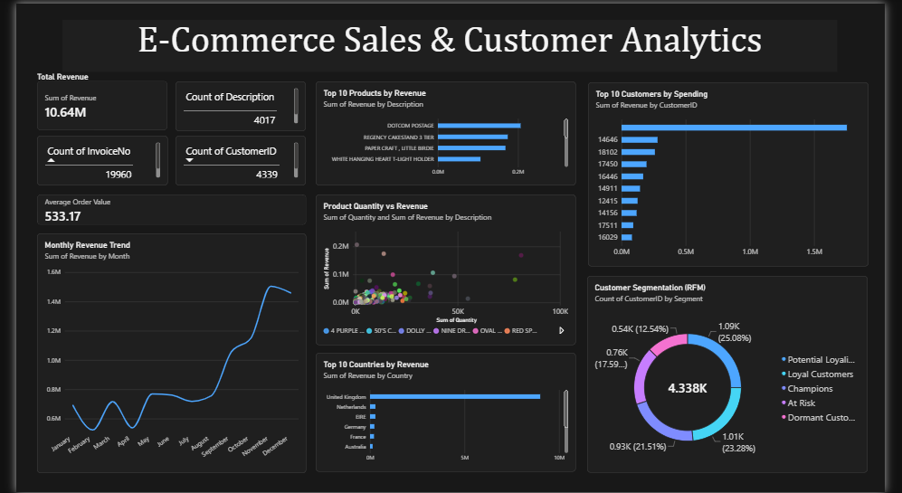

# 📊 E-Commerce Sales & Customer Analytics

## 📌 Project Overview

This project analyzes e-commerce transaction data to understand sales performance, customer behavior, product performance, and revenue trends.

The project uses Python, SQL, Excel, and Power BI to perform data cleaning, analysis, visualization, and business intelligence.

## 🛠️ Tools & Technologies

- Python
- Pandas
- NumPy
- Matplotlib
- SQL
- Excel
- Power BI

## 📈 Key Performance Indicators

| KPI | Value |
|---|---:|
| Total Revenue | £10.64M |
| Total Orders | 19,960 |
| Total Customers | 4,338 |
| Total Products | 3,922 |
| Total Countries | 38 |
| Average Order Value | £533.17 |

## 🔍 Analysis Performed

### Sales Analysis

- Monthly revenue analysis
- Top products by revenue
- Revenue by country
- Product quantity analysis
- Average Order Value analysis

### Customer Analysis

- Customer spending analysis
- Order frequency analysis
- Average customer spending
- RFM analysis
- Customer segmentation

### RFM Customer Segmentation

Customers were analyzed using:

- Recency
- Frequency
- Monetary Value

Customers were segmented into:

- Champions
- Loyal Customers
- Potential Loyalists
- At Risk
- Dormant Customers

## 📊 Power BI Dashboard

The project includes an interactive Power BI dashboard containing:

- Revenue KPI
- Total Orders
- Total Customers
- Total Products
- Average Order Value
- Monthly Revenue Trend
- Top 10 Products
- Top 10 Countries
- Top 10 Customers
- Quantity vs Revenue Analysis
- RFM Customer Segmentation



## 📁 Project Structure

```text
ecommerce-sales-customer-analytics/
│
├── README.md
├── dashboard.png
│
├── excel/
│   └── Ecommerce_Analytics.xlsx
│
├── powerbi/
│   └── Ecommerce_Analytics.pbix
│
├── python/
│   └── ecommerce_analysis.ipynb
│
├── sql/
│   └── ecommerce_analysis.sql
│
└── results/
    ├── customer_rfm_analysis.csv
    ├── product_analysis.csv
    ├── monthly_revenue.csv
    └── country_analysis.csv
